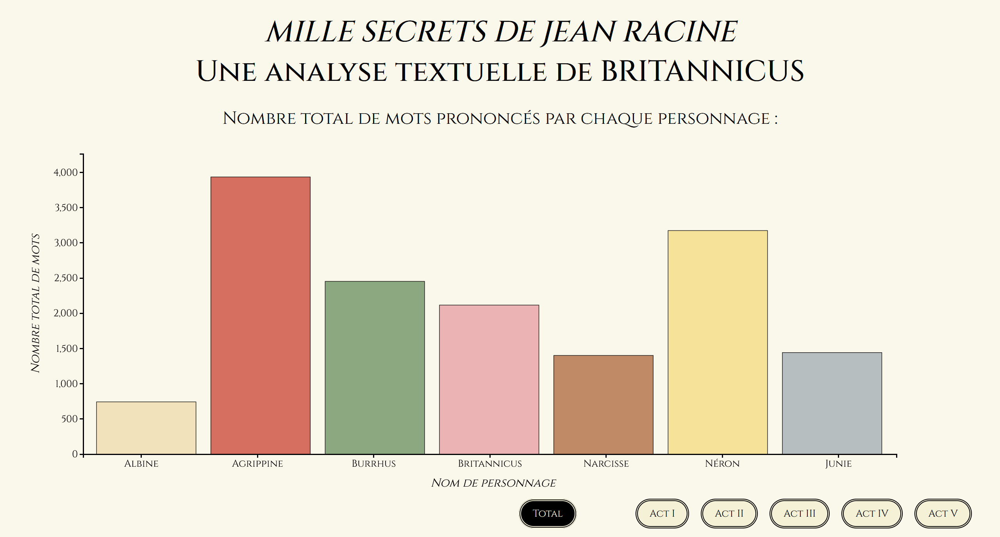
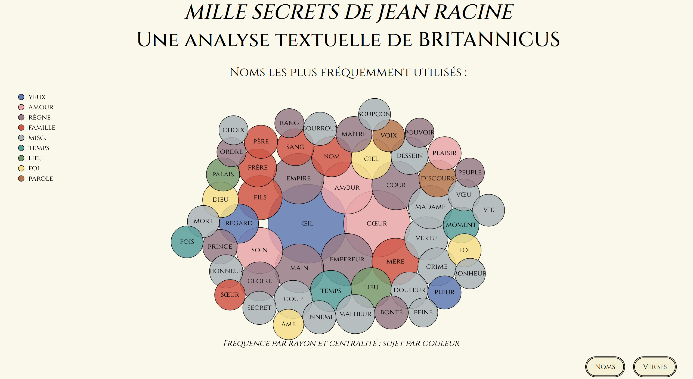
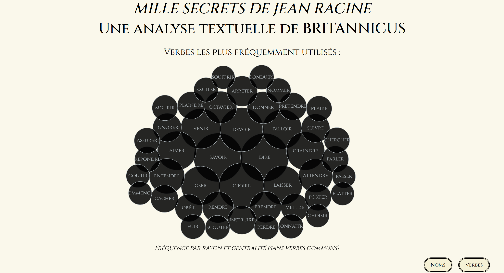

# "Mille Secrets" de Racine

---

A **textual analysis** and **data visualisation** of _Britannicus_ by Jean Racine. This project was created for the course on **Data Visualisation**, run by [Isaac Pante] at the [University of Lausanne] (UNIL). It also deployed textual analysis skills gained from the course on **Data Analysis**, run by [Aris Xanthos] and [François Bavaud] at University of Lausanne.

**Author**: _Philippa Payne_ (<philippa.payne@unil.ch>)

**Date**: _Spring Semester, 2022_

<figure>
    
</figure>

---

## Description

### Central Objectives

This project aimed to create a collection of data visualisations which expressed key statistics garnered from a textual analysis of Jean Racine's _Britannicus_. This project balanced aesthetic appeal, effective communication and accessible statistics.

1. Aesthetics and storytelling, as discussed, are at least a third of the data visualisation process. Thus, it was clear to me from an early stage that I would make my data visualisations conform to a specific creative vision. I believe that I achieved this objective. My data visualisations are attractive and appealing, thus demanding attention. I chose the colour palette from 19th century costume engravings for the play.
2. As this attempt was the first I had made, indeed maybe one of the first ever made, to visualise this play with data, I felt it was important to select data that was accessible and minimal. Too much data shown on one graphic would have distorted any clear message I wanted to communicate.
3. From my experience with programming thus far, I acknowledge that responsiveness and interactivity form a large part of what makes creative programming projects appealing and accessible. I therefore chose to spend time making my visualisations adaptive to the size of the browser window and adding small interactive elements to engage my audience further.

### Target Audience

These key statistics demonstrate the benefits of textual analysis to multiple target audiences, but, principally, students of literature and a general public interested in seeing a fresh perspective on a canonical piece of literature. By graphically representing Racine's theatrical work, this data visualisation project hopes to foreground the benfits of data analysis and computational techniques to humanities disciplines and, by extension, advocate for _Digital Humanities_ as an academic field.

### Key Features

This project consists of two types of graphic: bar charts and bubble charts. These forms of data visualisation are simple enough that everyone should be able to understand what they represent at a glance (using axes, size and colour).

- All graphics can adapt to the size of the browser window

### Bar Chart

<figure>
    
</figure>

- Transitions on page load for axes, labels and bars
- Buttons allow data input to be changed so one can view each act
- Colour was a creative sacrifice; whilst unscientific, it adds clarity

### Bubble Chart

<figure>
    
</figure>

<figure>
    
</figure>

- Tranisitions on page load for legend, labels and circles
- Buttons allow data input to be changed to verbs or nouns
- Key breaks down the nouns into groupings, to encourage further reflection

---

## Development

### 1. Data Collection

I first collected the data by performing my own textual analysis on _Britannicus_ using [Orange Data Mining], using the **Textable** and **Textable Prototypes** add-ons. I collected data pertaining to number of words, most common nouns, most common verbs, tenses used by each character, words that were unique to each character, etc.

### 2. Data Organisation

I first transferred the data form the resulting **Data Tables** into several .csv files and cut the data down so that it would fit my needs and purposes. I chose which data was the most significant after exploring and experimenting in the data collection stage of development.

### 3. Data Visualisation

This stage was when I put together the creative vision and the data sets I had collated. This stage was by far the most difficult and required that I undergo a lot of research in order to obtain the desired results (for example, circle packing).

### Tools Used

- [Orange Data Mining] : **Textable** and **Textable Prototypes**
- [D3]
- [Visual Studio Code] : **Live Server** and **Live Share**

### Progress Journal

Week 1 (02/05/2022) - brainstorming choice of project
Week 2 (09/05/2022) - data collection with Orange
Week 3 (16/05/2022) - data organisation to .csv
Week 4 (23/05/2022) - data visualisation drafting
Week 5 (30/05/2022) - data visualisation with D3.js
Week 6 (06/05/2022) - finalising drafts with GitHub

---

## Sources

- [Dear Data] was a significant source of inspiration and performing various handwritten _Dear Data_ tasks helped me understand what data visualisation should and should not be.
- [Observable HQ] was a useful source that helped me work out how to make a bubble chart with interactive components.
- [D3 Graph Gallery] was a useful source that helped me work out how to make a bar chart with interactive components.
- _Britannicus_, Jean Racine
- [Malades imaginaires] is an existing data visualisation project which I was vastly dissatisfied with, something which motivated me to try to create a more compelling and useful data visualisation.

---

## Installation

- Ensure you have set up a local server or have access to a live server extension via your chosen Integrated Development Environment (IDE) in order to display the data associated with the _.csv_ data file for the project. For example, download [Visual Studio Code] and add the [Live Server] extension.
- Download the files in the [GitHub] repository for the project, [racineDataVis], in order to view the project.

---

## Conclusions

There are clearly some obvious limitations to my project:

- I would love to improve the interactive component by adding more detail. For example, I would like to show relevant quotes on "hover" or "click" for the nouns and verbs. Similarly, I would like to play an audio clip for each character on "hover" or "click" for the bar chart graphic.
- I am also aware that some of my code is rather amateur and could be improved with loops and iterations. Most of my choices were made on the basis of whether I could "make them" work or not.
- I would like to improve the bar chart graphic so that the axes and labels only appear once, on page load, and then only the bars transition when the data is changed; however, my attempts to integrate this component have failed so far.
- I would like to work more on representing _topic modelling_ through data visualisation. I think an appropriate graphic would be a streamgraph, showing the development of key topics throughout the play, broken down into acts.
- Of course this data visualisation project could benefit from greater depth and breadth in general. As this project was done individually, there were certain limitations in terms of using time efficiently and setting an appropriate scope to the project.
  -I considered it to be more important to create a well-rounded and complete data visualisation project rather than focus on the complexity of any one of its elements. The level of intricacy can be scaled up now the first draft of the project is complete.

---

## Acknowledgements

Thanks go to [Isaac Pante] for providing a course that demonstrated the power of data visualisation to effectively communicate information in the social sciences and humanities. Thanks go to [Aris Xanthos] for providing a course that demonstrated the power of data analysis to effectively extrapolate results in the social sciences and humanities. Thanks go to [Alain Cernuschi] for providing the literary analysis course on _Britannicus_.

[isaac pante]: https://github.com/ipante
[university of lausanne]: https://www.unil.ch/central/en/home.html
[aris xanthos]: https://github.com/axanthos
[françois bavaud]: https://applicationspub.unil.ch/interpub/noauth/php/Un/UnPers.php?PerNum=3052&LanCode=8&menu=coord
[orange data mining]: https://orangedatamining.com/
[d3]: https://d3js.org/
[visual studio code]: https://code.visualstudio.com/
[dear data]: http://www.dear-data.com/theproject
[observable hq]: https://observablehq.com/@d3/bubble-chart
[d3 graph gallery]: https://d3-graph-gallery.com/
[malades imaginaires]: https://maladesimaginaires.github.io/intnetviz/?author=jean_racine&play=britannicus
[github]: https://github.com/P-C-R-P
[racinedatavis]: https://github.com/P-C-R-P/racineDataVis
[alain cernuschi]: https://applicationspub.unil.ch/interpub/noauth/php/Un/UnPers.php?PerNum=30042&LanCode=8
[live server]: https://marketplace.visualstudio.com/items?itemName=ritwickdey.LiveServer
